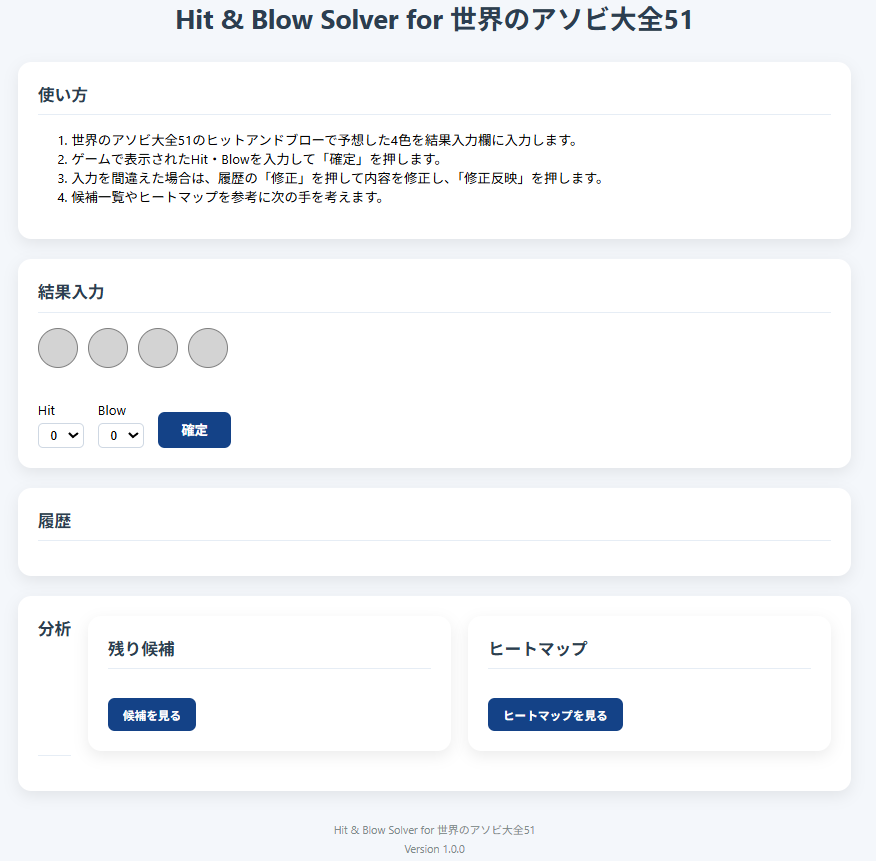
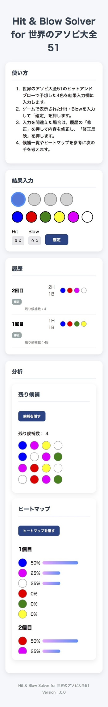

# 画面仕様書

## 画面一覧

|画面|内容|
|---|---|
|メイン画面|Hit & Blow Solver本体|

---

# メイン画面

## レイアウト

```
┌───────────────────────────────┐
│ タイトル                       │
├───────────────────────────────┤
│ 使い方                         │
├───────────────────────────────┤
│ 結果入力                       │
│  ○ ○ ○ ○                      │
│                                │
│  Hit ▼                         │
│  Blow ▼                        │
│  [確定]                        │
├───────────────────────────────┤
│ 履歴                           │
│ 4回目 2H1B ○○○○ [修正]         │
│        残り候補数：12           │
├───────────────────────────────┤
│ 分析                           │
│ ┌──────────────┐              │
│ │ 残り候補      │              │
│ └──────────────┘              │
│ ┌──────────────┐              │
│ │ ヒートマップ  │              │
│ └──────────────┘              │
├───────────────────────────────┤
│ フッター                       │
└───────────────────────────────┘
```

---

# 実際の画面

## PC画面



### 説明

- 分析エリアは横並び
- 履歴は1行表示
- 候補一覧・ヒートマップはカード形式

---

## スマートフォン画面



### 説明

- 横幅いっぱいに表示
- 履歴は1行表示を維持
- 分析エリアは縦並び
- ボタンサイズをスマホ向けに調整

---

# エリア構成

## 1. ヘッダー

表示内容

- タイトル

目的

ツール名を表示する。

---

## 2. 使い方

表示内容

- 操作説明

目的

初めて使う人でも操作できるようにする。

---

## 3. 結果入力

表示内容

- 色入力スロット
- カラーパレット
- Hit入力
- Blow入力
- 確定ボタン

目的

ゲーム結果を入力する。

---

## 4. 履歴

表示内容

- 手数
- Hit
- Blow
- 入力色
- 修正ボタン
- 残り候補数（候補表示中のみ）

目的

入力履歴の確認・修正を行う。

---

## 5. 分析

### 残り候補

表示内容

- 候補数
- 候補一覧

### ヒートマップ

表示内容

- 各色出現率

目的

次の手を考える材料を提供する。

---

## 6. フッター

表示内容

- アプリ名

目的

アプリ情報を表示する。


---

# レスポンシブ対応

## PC

- 分析エリアを横並び表示

```
┌────────────┬────────────┐
│残り候補     │ヒートマップ │
└────────────┴────────────┘
```

---

## スマートフォン

- 横幅いっぱいに表示
- 履歴は1行表示を維持
- ボタン・色サイズを自動調整

---

# デザイン方針

- シンプル
- 白背景
- カードUI
- 青系ボタン
- 角丸デザイン
- スマホ・PC共通レイアウト